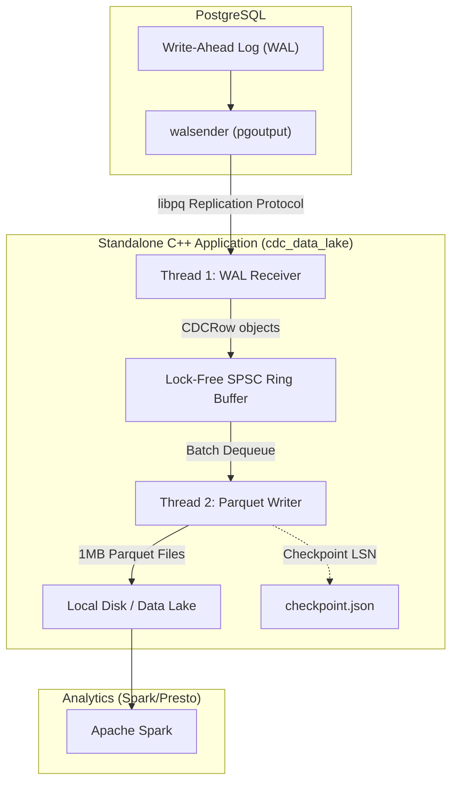
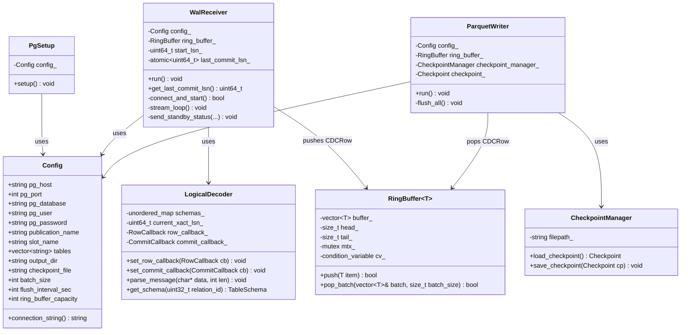
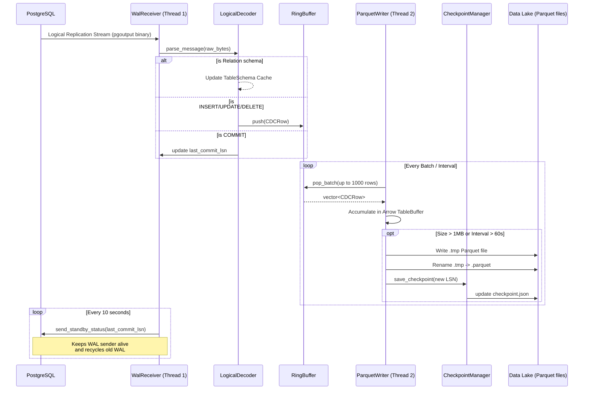

# CDC Data Lake — Architecture & Design

This document provides a comprehensive overview of the **CDC Data Lake** architecture. It is a standalone C++ application that seamlessly streams Change Data Capture (CDC) events from PostgreSQL and outputs them as partitioned, compressed Parquet files optimized for analytics engines like Apache Spark, Trino, and Presto.

---

## 1. Architectural Overview

The application is designed using a **producer-consumer** architecture to decouple the fast I/O of reading from PostgreSQL from the CPU-intensive task of Parquet compression and serialization.

### Why this architecture?
1. **Zero Database Impact:** By using a standalone application, we eliminate the risk of crashing the PostgreSQL instance (a major risk with custom C extensions).
2. **Native Output Format:** Using PostgreSQL's built-in `pgoutput` plugin means we don't need to write any C-level decoding logic inside PostgreSQL.
3. **High Throughput:** The two-thread design ensures that Parquet compression (which uses Snappy/ZSTD and is CPU-heavy) does not block the thread receiving network packets from PostgreSQL.
4. **Data Lake Ready:** Spark and Presto prefer large (~1MB+) column-oriented files. Generating these files directly saves us from having to run intermediate compaction jobs.

---

## 2. Component Details

### A. The PostgreSQL pgoutput Plugin
The foundation of this CDC pipeline is PostgreSQL's logical decoding feature, specifically the built-in `pgoutput` plugin. 

- **Publication (`CREATE PUBLICATION`)**: Determines *which* tables' changes are streamed. It acts as a source-side filter.
- **Replication Slot**: Keeps track of how far the application has read in the WAL (Write-Ahead Log), ensuring that PostgreSQL does not delete WAL files before we've processed them.
- **Binary Protocol**: Instead of strings, `pgoutput` sends highly structured binary messages (Relation schemas, Begin/Commit transaction boundaries, and Insert/Update/Delete row operations).

### B. Configuration & Initialization (`config.cpp` & `pg_setup.cpp`)
When the application starts, it reads `cdc_data_lake.conf` and connects to PostgreSQL to automatically provision everything it needs:
1. Validates that `wal_level = logical` is set in `postgresql.conf`.
2. Creates the publication dynamically based on the configured table filters.
3. Creates the logical replication slot if it doesn't already exist.
This makes the application entirely self-bootstrapping.

### C. The WAL Receiver Thread (`wal_receiver.cpp`)
This is **Thread 1** (The Producer). 

- **LibPq Replication Mode**: Connects to PostgreSQL using `START_REPLICATION SLOT ... LOGICAL ...`.
- **Streaming Loop**: Uses the `select()` system call with `PQgetCopyData()` to read the replication stream without spinning the CPU.
- **pgoutput_parser.cpp**: This component parses the raw binary bytes from PostgreSQL. It maintains a cache of table schemas (from 'Relation' messages) so it knows column names and types. It translates 'Insert', 'Update', and 'Delete' messages into a structured C++ `CDCRow` object.
- **Keepalives**: Periodically sends heartbeat messages (Standby Status Updates) back to PostgreSQL, acknowledging the highest LSN (Log Sequence Number) we've seen to prevent timeouts.

### D. Lock-Free SPSC Ring Buffer (`ring_buffer.h`)
This is the **bridge** between Thread 1 and Thread 2.

- **SPSC**: Single-Producer, Single-Consumer.
- **Thread-Safe**: Uses mutexes and condition variables (optimized with lock-free atomic index tracking) to allow Thread 1 to safely hand off `CDCRow` objects to Thread 2.
- **Batching**: Allows the consumer to pull up to 1000 rows at a time, drastically reducing lock contention and improving throughput.

### E. The Parquet Writer Thread (`parquet_writer.cpp`)
This is **Thread 2** (The Consumer). It is responsible for accumulating rows and compressing them into Parquet files.

In this component, high-throughput conversion from row-oriented PostgreSQL data to column-oriented analytics format takes place:
- **`TableBuffer` Accumulation**: The writer maintains a distinct in-memory `TableBuffer` for each PostgreSQL table it tracks. As rows (`CDCRow`) are dequeued from the `RingBuffer`, they are immediately routed to their corresponding `TableBuffer`.
- **Apache Arrow Builders**: Inside the `TableBuffer`, data is appended to in-memory columnar structures using `arrow::StringBuilder` and `arrow::Int64Builder`. Arrow efficiently pivots the row-based event stream into a dense column-based memory representation.
- **Flush Conditions**: The writer periodically iterates over all active `TableBuffers` and checks two flush conditions:
  1. **Size Limit**: Has the buffer accumulated the configured file size limit (e.g., ~1MB of data)?
  2. **Time Limit**: Has the buffer hit the timeout limit (e.g., 60 seconds since the last flush)?
- **Parquet File Writing (`flush_table_buffer`)**: When a flush condition is met, the `TableBuffer` finalizes the Arrow arrays, constructing an `arrow::Table`. This table is encoded to disk with **Snappy compression**, embedding key schema metadata and CDC boundaries (like start/end LSN and timestamp boundaries) directly into the Parquet footer.
- **Spark-Friendly Partitioning**: Files are segregated into isolated directories named identically to the source table (e.g., `output_dir/my_table/...`).
- **Atomic Renames**: To guarantee data integrity for downstream analytics engines (like Apache Spark or Trino), files are initially staged with a `.tmp` extension. Only when the file is completely encoded and closed is an atomic system rename performed to change the extension to `.parquet`.

### F. Checkpointing & Crash Recovery (`checkpoint.cpp`)
To ensure **At-Least-Once Delivery** and zero data loss during crashes:

- Whenever the Parquet Writer successfully renames a `.tmp` file to `.parquet`, it records the `end_lsn` of that batch into a `checkpoint.json` file.
- When the application starts up, it reads `checkpoint.json`. Instead of asking PostgreSQL for all data from the beginning (`0/0`), it asks PostgreSQL to resume streaming exactly from the `last_confirmed_lsn`.
- This ensures that if the server crashes or loses power, the pipeline picks up right where it left off, and PostgreSQL knows it can safely delete old WAL files up to that point.

---

## 3. Data Schema and Metadata

Every generated Parquet file contains the native columns of the PostgreSQL table, plus three injected metadata columns that are crucial for downstream CDC processing:

1. **`_cdc_operation`**: `"INSERT"`, `"UPDATE"`, or `"DELETE"`.
2. **`_cdc_lsn`**: The Log Sequence Number (LSN) identifying the exact position of the change in the WAL. Useful for deduplication and ordering.
3. **`_cdc_timestamp`**: The transaction commit time in microseconds, provided by PostgreSQL.

### Parquet Footer Metadata
In addition to column data, the Parquet file's internal key-value metadata footer contains:
- `cdc.start_lsn` / `cdc.end_lsn`: The WAL range contained in the file.
- `cdc.start_time` / `cdc.end_time`: The time range contained in the file.
- `cdc.row_count`: Total rows in the file.

This allows analytics tools to quickly skip files that aren't relevant to a specific timeframe or LSN range without having to scan the actual column data.

---

## 4. System Diagrams

### Class Diagram

The following diagram illustrates the primary classes, their responsibilities, and relationships within the standalone C++ application.

### Sequence Diagram: Normal Data Flow

This sequence diagram outlines the flow of data from PostgreSQL, through the pipeline, and onto disk as Parquet files.

